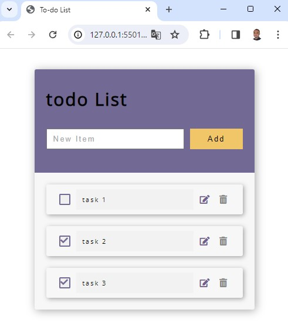

# 
  To-Do List Modified

## Goal

This was a modification made to the [Todo-List](https://github.com/JobsonAlmeidaTech/To-do-List) project. 

## Concepts learned

Through this project I could exercise how to work with MVC Architecture Pattern, how to work with promises and how to make asynchronous requisitions using XMLHttpRequest objects and fetch API. 
I've decided to create another repository because the project was entirely remodeled using those concepts.
